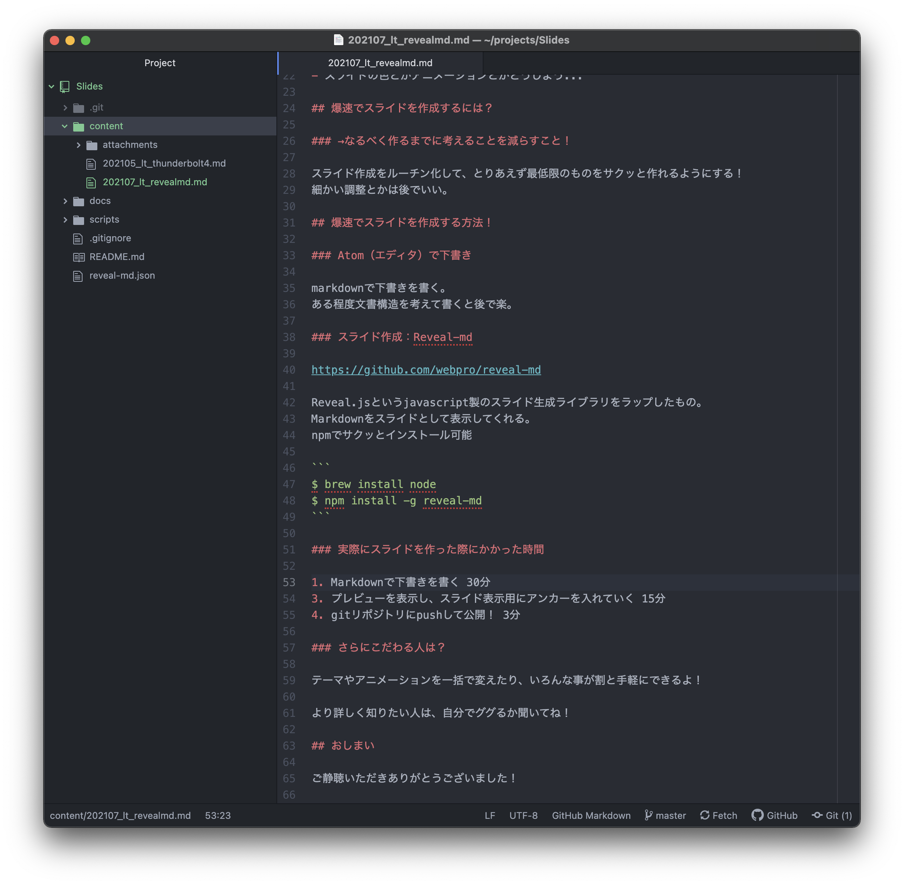
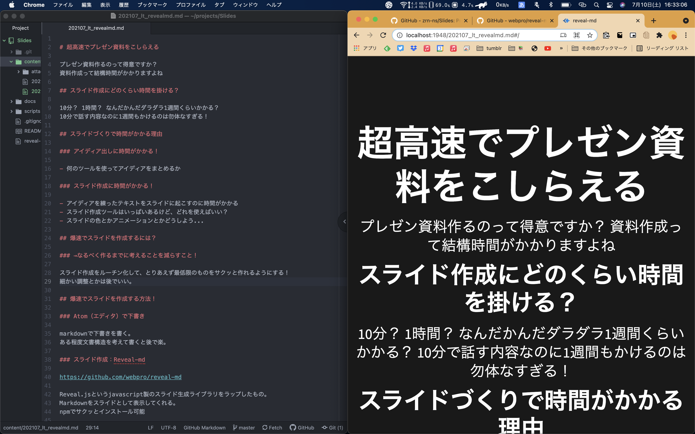
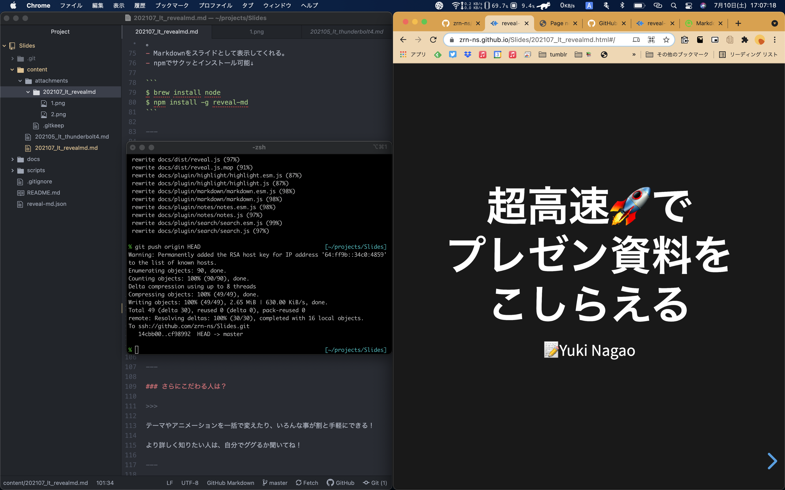
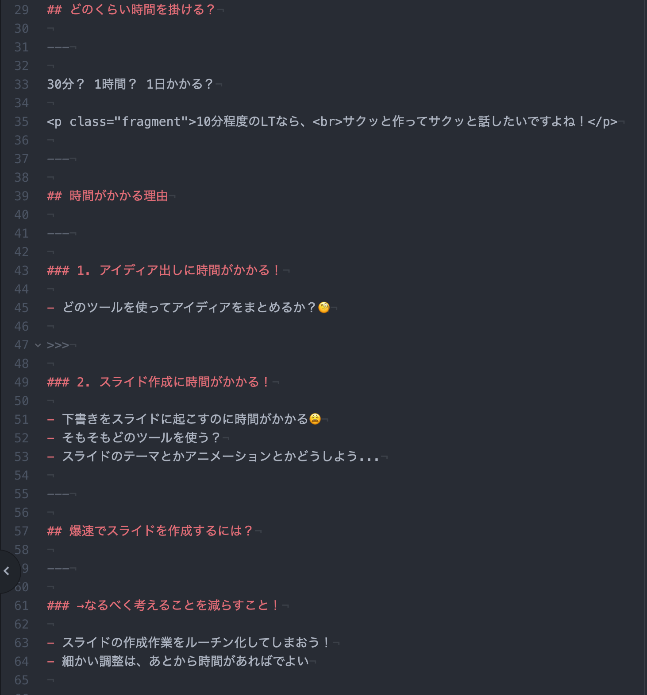

# 爆速🚀 スライド 作成術 

📝Yuki Nagao

---

突然ですが、

皆さんはプレゼン資料作るのは得意ですか？

>>>

資料作成って結構時間がかかりますよね

>>>

僕もかなり時間がかかる方です

---

## どのくらい時間を掛ける？

---

30分？ 1時間？ 1日かかる？

10分程度のLTなら、 サクッと作ってサクッと話したいですよね！

---

## 時間がかかる理由

---

### 1. アイディア出しに時間がかかる！

- どのツールを使ってアイディアをまとめるか？🧐

>>>

### 2. スライド作成に時間がかかる！

- 下書きをスライドに起こすのに時間がかかる😩
- そもそもどのツールを使う？
- スライドのテーマとかアニメーションとかどうしよう...

---

## 爆速でスライドを作成するには？

---

### →なるべく考えることを減らすこと！

- スライドの作成作業をルーチン化してしまおう！
- 細かい調整は、あとから時間があればでよい

---

## 具体的なルーチン

---

1. 発表の下書きをmarkdownで書く
2. 下書きからスライドを生成して整形

>>>

### 1. 発表の下書きをmarkdownで書く

- Markdown形式で下書きを書く
- 文書構造を考えて書くと後から楽

>>>

### 2. 下書きからスライドを生成して整形

[Reveal-md](https://github.com/webpro/reveal-md)というライブラリを使うと、markdownからスライドを生成できる

- このスライドはReveal-mdで生成した
- 生成したスライドはhtmlで出力されるので、GitHub Pages等でホスト可能
- 自動でそれなりにリッチな見た目になるし、細かくカスタマイズも可能

---

### 実際にスライドを作ってみる📝

>>>

#### 1. Markdownで下書き: 30分

>>>

#### 2. プレビューを見つつ調整: 30分

>>>

#### 3. reveal-mdコマンドでスライドを生成 gitリポジトリにpushして公開: 5分

>>>

**トータル60分🚀(大体)**

>>>

最終的なソースはこんな感じ↓

---

## さらにこだわる人は？

>>>

### やろうと思えばいろいろできる！（ふんわり）

>>>

例えば...

>>>

画像をスタック表示したり

  
  
  

>>>

コードの表示も簡単にリッチな表示に！

<pre><code data-line-numbers="7-7|10-13|14-14">
class ViewController: UIViewController {

    override func viewDidLoad() {
        super.viewDidLoad()

        var times: RepeatTimes = .zero
        do {
            times = try .init(3)
        } catch {
            // エラー処理等
            print(error)
        }
        label.text = "Hello".repeated(times: times)
    }

    @IBOutlet private weak var label: UILabel!
}
</code></pre>

---

↓今回のスライド↓

https://zrn-ns.github.io/Slides/202107_lt_revealmd.html#/

↓今回のスライドのソースコード↓

https://github.com/zrn-ns/Slides/blob/master/content/202107_lt_revealmd.md

---

## おしまい🍵

ご静聴いただきありがとうございました！
